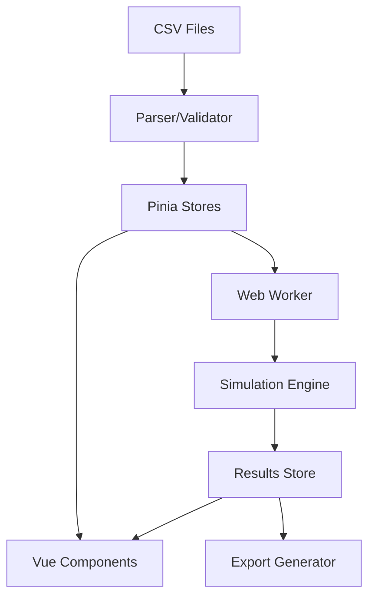

# Time Hero Simulator - Tech Stack & Architecture
## Document 0: Foundation & Planning

### Executive Summary
The Time Hero Simulator is a professional game balance testing tool designed to model and analyze the complete economic progression of Time Hero, an idle farming game for the Playdate console. This web-based application enables developers to validate game balance, identify bottlenecks, and optimize the 3-4 week player journey from tutorial to endgame.

### Project Goals

#### Primary Objectives
1. **Economic Validation**: Test and validate the game's resource economy across all phases
2. **Bottleneck Detection**: Identify progression blockers and friction points
3. **Player Behavior Modeling**: Simulate different player archetypes and playstyles
4. **Data-Driven Balance**: Provide quantitative insights for tuning decisions
5. **Rapid Iteration**: Enable quick testing of balance changes without game builds

#### Success Metrics
- Accurately predict player progression within ±10% of actual gameplay
- Identify 100% of hard progression blocks
- Provide real-time visual feedback during simulation
- Support testing of 5+ distinct player archetypes
- Generate actionable balance recommendations

### Technical Requirements

#### Platform & Deployment
- **Target**: Desktop web application optimized for MacBook Air (1440x900)
- **Hosting**: GitHub Pages (static site deployment)
- **Browser Support**: Modern Chrome, Firefox, Safari (2023+)
- **Offline Capability**: Full functionality after initial load

#### Performance Requirements
- Support variable simulation speeds (1x to max speed)
- Provide smooth visual feedback during simulation
- Handle 1000+ data points without UI lag
- Support real-time visualization at 60fps
- Memory footprint <500MB for complete simulation

### Proposed Tech Stack

#### Core Framework
```
Frontend Framework: Vue 3.4+ with Composition API
Build Tool: Vite 5.0+
Language: TypeScript 5.3+
Package Manager: pnpm (for efficient dependency management)
```

**Rationale**: Vue 3 provides excellent reactive data handling crucial for real-time simulation display, while Vite offers lightning-fast HMR for rapid development iteration.

#### State Management
```
Global State: Pinia 2.1+
Persistence: LocalStorage + IndexedDB (via LocalForage)
Data Flow: Unidirectional with strict typing
```

**Rationale**: Pinia's modular store architecture maps perfectly to game systems (farmStore, combatStore, etc.), with DevTools integration for debugging.

#### Data Layer
```
CSV Parsing: PapaParse 5.4+
Data Validation: Zod 3.22+
Data Processing: Lodash-es 4.17+
Export Generation: File-saver 2.0+
```

**Architecture Decision**: CSV files remain the source of truth, loaded into memory on app initialization with validation layer ensuring data integrity.

#### Visualization & UI
```
UI Framework: Tailwind CSS 3.4+ with custom gaming theme
Component Library: Headless UI 1.7+ (minimal external dependencies)
Icons: Font Awesome 6 (free tier)
Charts: Chart.js 4.4+ with vue-chartjs
Graph Visualization: Cytoscape.js 3.28+ (Civ V-style tech tree layout)
Data Tables: TanStack Table 8.11+ (virtual scrolling for performance)
Persistence: LocalStorage for simplicity
```

#### Performance & Background Processing
```
Web Workers: Comlink 4.4+ for worker communication
Virtual Scrolling: TanStack Virtual 3.0+
Memoization: Built into Vue computed properties
Throttling: Lodash throttle/debounce
```

### Architecture Overview

#### Application Structure
```
time-hero-simulator/
├── src/
│   ├── components/          # Reusable UI components
│   │   ├── common/          # Buttons, modals, forms
│   │   ├── charts/          # Chart components
│   │   ├── tables/          # Data table components
│   │   └── visualizers/     # Game-specific visualizations
│   ├── views/               # Page components (7 main tabs)
│   │   ├── Dashboard.vue
│   │   ├── GameConfiguration.vue
│   │   ├── UpgradeTree.vue
│   │   ├── PlayerPersonas.vue
│   │   ├── SimulationSetup.vue
│   │   ├── LiveMonitor.vue
│   │   └── Reports.vue
│   ├── stores/              # Pinia stores
│   │   ├── gameData/        # CSV data stores
│   │   ├── simulation/      # Simulation state
│   │   └── ui/              # UI state
│   ├── workers/             # Web Worker scripts
│   │   └── simulator.worker.ts
│   ├── utils/               # Utility functions
│   │   ├── parsers/         # CSV parsing
│   │   ├── validators/      # Data validation
│   │   └── exporters/       # Report generation
│   ├── services/            # Business logic
│   │   ├── SimulationEngine.ts
│   │   ├── PersonaManager.ts
│   │   └── AnalysisEngine.ts
│   └── styles/              # Global styles
│       └── theme.css        # Dark gaming theme
├── public/
│   └── data/                # CSV files
├── docs/                    # Generated documentation
└── dist/                    # Build output
```

#### Data Flow Architecture


#### Component Communication
- **Props Down, Events Up**: Strict parent-child communication
- **Store for Shared State**: Cross-component data via Pinia
- **Event Bus**: For system-wide notifications only
- **Web Worker Messages**: Structured message protocol for simulation

### Data Management Strategy

#### CSV as Source of Truth
```typescript
interface DataStrategy {
  loading: 'lazy' | 'eager';  // Eager for core data
  validation: 'strict';        // Fail fast on bad data
  caching: 'memory';          // Full in-memory for performance
  persistence: 'indexeddb';   // For custom configurations
}
```

#### Data Pipeline
1. **Import**: CSV files loaded via fetch on app init
2. **Parse**: PapaParse with type coercion
3. **Validate**: Zod schemas ensure data integrity
4. **Transform**: Convert to normalized structures
5. **Store**: Load into Pinia stores
6. **Index**: Create lookup maps for O(1) access

#### Simulation Timing
- **Time Granularity**: 30-second ticks for balance between accuracy and performance
- **Speed Control**: User adjustable from 1x to max speed
- **Visual Feedback**: Updates every tick at slower speeds, throttled at higher speeds

### Security & Privacy
- **No Backend**: Fully client-side application
- **No Tracking**: No analytics or telemetry
- **Local Storage**: All data stays in browser
- **Export Only**: User explicitly exports data

### Development Workflow

#### Local Development
```bash
# Install dependencies
pnpm install

# Start dev server with HMR
pnpm dev

# Type checking
pnpm type-check

# Run tests
pnpm test

# Build for production
pnpm build
```

#### CI/CD Pipeline
```yaml
# GitHub Actions workflow (.github/workflows/deploy.yml)
name: Deploy to GitHub Pages

on:
  push:
    branches: [main]
  workflow_dispatch:

jobs:
  build-and-deploy:
    runs-on: ubuntu-latest
    steps:
      - uses: actions/checkout@v3
      - uses: pnpm/action-setup@v2
      - uses: actions/setup-node@v3
        with:
          node-version: 18
          cache: 'pnpm'
      - run: pnpm install
      - run: pnpm build
      - uses: peaceiris/actions-gh-pages@v3
        with:
          github_token: ${{ secrets.GITHUB_TOKEN }}
          publish_dir: ./dist
```

**Deployment Configuration**:
- Base URL configuration for GitHub Pages
- Asset optimization and compression
- Service worker for offline functionality

### Browser Compatibility Strategy
- **Baseline**: ES2022 features
- **Polyfills**: None (modern browsers only)
- **Progressive Enhancement**: Core features work everywhere
- **Graceful Degradation**: Advanced features check support

### Performance Budget
```
Initial Load: <3 seconds
Time to Interactive: <5 seconds
Bundle Size: <2MB gzipped
Memory Usage: <500MB peak
Frame Rate: 60fps for animations
```

### Scalability Considerations
- **Data Volume**: Support 10,000+ simulation events
- **Report Storage**: IndexedDB for unlimited reports
- **Concurrent Simulations**: Web Worker pool for parallel runs
- **Large Datasets**: Virtual scrolling for tables

### Testing Strategy
```
Unit Tests: Vitest for logic
Component Tests: Vue Test Utils
E2E Tests: Playwright for critical paths
Performance Tests: Lighthouse CI
Data Validation: Automated CSV testing
```

### Documentation Requirements
- **Code Documentation**: TSDoc comments
- **User Guide**: Markdown in /docs
- **API Reference**: Generated from types
- **Change Log**: Semantic versioning

### Risk Mitigation
1. **Data Corruption**: Validation at every step
2. **Performance Issues**: Web Worker isolation
3. **Browser Incompatibility**: Feature detection
4. **Memory Leaks**: Automatic cleanup
5. **Lost Work**: Auto-save to IndexedDB

### Technical Decisions

#### Component Library Choice
**Decision**: Headless UI + Custom Components
- **Rationale**: Minimal dependencies, full control over styling, better performance
- **Trade-offs**: More initial development time, but better long-term maintainability
- **Alternative considered**: PrimeVue (rejected due to bundle size)

#### Graph Visualization
**Decision**: Cytoscape.js for Upgrade Tree
- **Rationale**: Best support for directed graphs, Civ V-style layouts possible
- **Features**: Pan/zoom, node clustering, edge bundling, layout algorithms
- **Alternative considered**: D3.js (more complex), vis-network (less features)

#### Data Tables
**Decision**: TanStack Table (formerly React Table)
- **Rationale**: Framework agnostic, virtual scrolling, excellent performance
- **Features**: Sorting, filtering, grouping, inline editing
- **Alternative considered**: ag-Grid (too heavy), custom implementation (time consuming)

#### Export Formats
**Decision**: JSON (primary) + Markdown (human readable) + CSV (re-import)
- **JSON**: Complete data with metadata for analysis
- **Markdown**: Formatted reports for documentation
- **CSV**: Allow re-export of modified configurations
- **LLM Export**: Structured JSON with context and documentation

### Future Considerations
- **Cloud Sync**: Optional Firebase integration
- **Multiplayer**: Compare simulations with team
- **AI Integration**: LLM analysis endpoints
- **Mobile Version**: Responsive design phase 2
- **Real Game Data**: Import actual player data

### Development Phases

#### Phase 1: Foundation (Week 1-2)
- Project setup and configuration
- Core data loading system
- Basic UI shell with routing

#### Phase 2: Data Management (Week 3-4)
- Game Configuration page
- CSV import/export
- Data validation

#### Phase 3: Visualization (Week 5-6)
- Upgrade Tree renderer
- Dashboard charts
- Live Monitor displays

#### Phase 4: Simulation (Week 7-8)
- Simulation engine
- Web Worker integration
- Player personas

#### Phase 5: Analysis (Week 9-10)
- Reports generation
- Bottleneck detection
- Export systems

#### Phase 6: Polish (Week 11-12)
- Performance optimization
- UI polish
- Documentation

### Success Criteria
The project succeeds when:
1. ✅ Simulations accurately model real gameplay
2. ✅ Developers can identify and fix balance issues
3. ✅ Testing iteration time reduced by 90%
4. ✅ All player archetypes can complete game
5. ✅ Performance meets all budget targets

### Conclusion
This architecture provides a robust, performant, and maintainable foundation for the Time Hero Simulator. The chosen tech stack leverages modern web standards while maintaining simplicity and focusing on the core goal: validating game balance through data-driven simulation.
